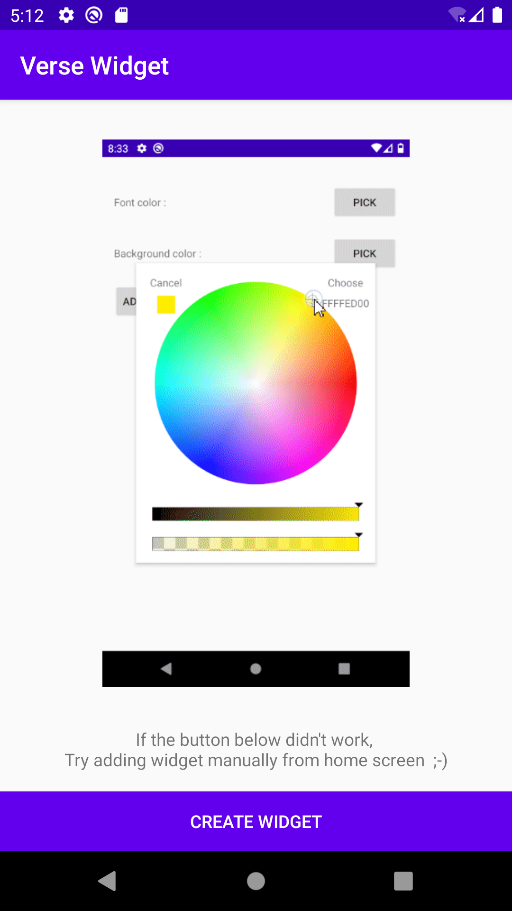
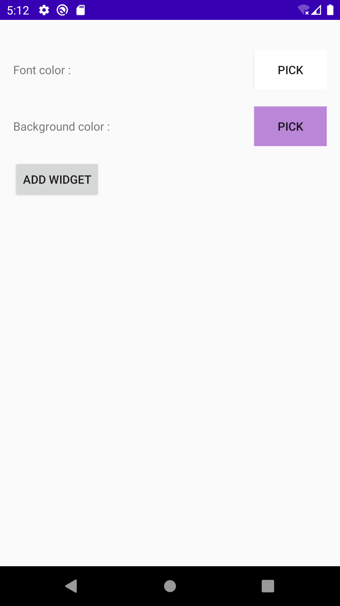
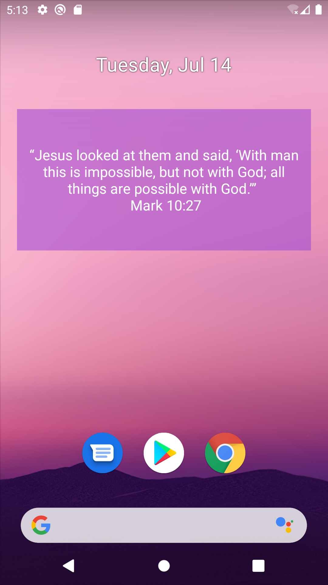

%Verse Widget
<html lang="en">
<head>
    <meta charset="UTF-8">
    <meta name="viewport" content="width=device-width, initial-scale=1.0">
    <title>Songs of zion</title>
    <link rel="stylesheet" href="https://stackpath.bootstrapcdn.com/bootstrap/4.4.1/css/bootstrap.min.css" integrity="sha384-Vkoo8x4CGsO3+Hhxv8T/Q5PaXtkKtu6ug5TOeNV6gBiFeWPGFN9MuhOf23Q9Ifjh" crossorigin="anonymous">
</head>
<body>

    <h1 class="mt-5 text-center heading text-muted">Verse Widget (v1.0.0)</h1>
    <h6>by <a href="https://oswin1998.cf/">Oswin Jerome</a></h6>
    <a href="https://github.com/oswin-jerome/verse-widget/releases/download/v1.0.0/verse.widget.v1.0.0.apk" class="btn btn-success mt-4">Download</a>

        

            
        

        

            
        

        

            
        

    

</body>
</html>